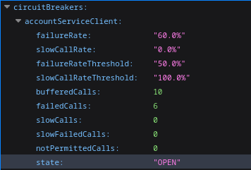
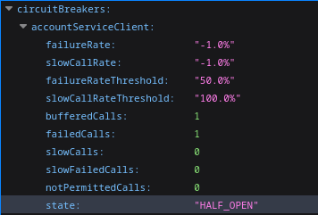
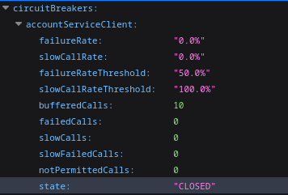

The purpose of project is demonstrate how work Circuit Breaker and Broker message to provider more resilience into microservices.This project consists of multiple services (`account-manager`, and `user-manager`) that can be deployed using Docker and Docker Compose.

## Prerequisites

1. Install [Docker](https://docs.docker.com/get-docker/).
2. Install [Docker Compose](https://docs.docker.com/compose/install/).
3. Ensure the JAR files for each service are built using Maven:
   ```bash
   cd account-manager
   mvn clean package
   ``` 
   
   ```bash
   cd users-manager
   mvn clean package
   ```
## Running the Services with Docker Compose

1. Navigate to the **infrastructure** directory where the `docker-compose.yaml` file is located:
    ```bash
    cd infrastructure
    ```
2. Start the services using Docker Compose:
    ```bash
    docker-compose up --build -d
    ```
3. Checking the logs all services are running:
   ```bash
    docker-compose logs -f
    ```
## Accessing the Services


1. Create new user through swagger:

    - **User Manager:** http://localhost:8090/swagger-ui/index.html

2. Check the Circuit Breaker using actuator:

    - **Circuit Breaker Actuator:** http://localhost:8090/actuator/circuitbreakers

3. Checking messages sending to Apache Kafka:

    - **Kafka UI:** http://localhost:8000

## Testing Circuit Breaker

For see OPEN status on Circuit Breaker, make 10 request with account-service off, in this case image bellow 10 request on total, and 6 request with failed sending



After 30 seconds make one more request to see HALF OPEN status on Circuit Breaker



And make requests with account-service up to see CLOSED status.




> 📚 **Read more:** Read more about Resilience visit this articles on Medium: [Uma dose de resiliência nos micro serviços](https://medium.com/@eduardo.borsato.oli/uma-dose-de-resili%C3%AAncia-nos-micro-servi%C3%A7os-77105758d4bb) and [O que é um software Resiliente? ](https://medium.com/@eduardo.borsato.oli/o-que-%C3%A9-um-software-resiliente-283b35f97bc8)
